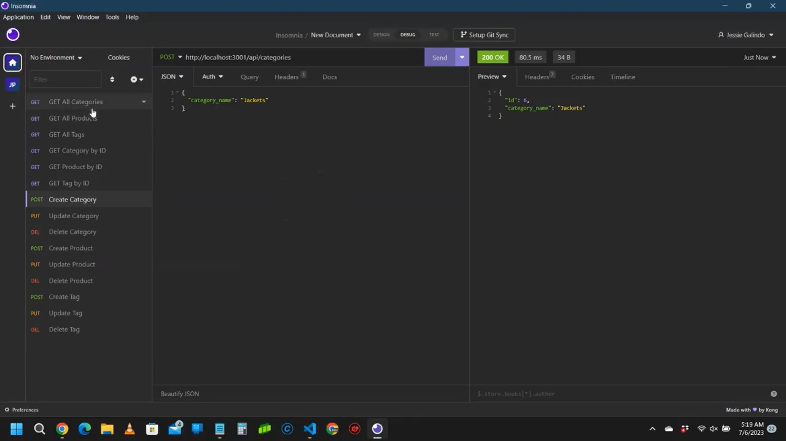

# E-Commerce Back-End

## Description

I was tasked with creating a Node.js backend database app that uses Express and MySql2 and can be interacted with using Postman or Insomnia. I used Node.js, Nodemon, Express.js, MySQL2, DotENV, and Sequelize.

## Installation

In order to install this app, you would clone the [repository](https://github.com/MrMessyFace/e-commerce-back-end) from GitHub. After you have cloned the repository, you would type "npm i" into the terminal to install the NPM packages. After the packages are installed, you would put your MySQL username and password into the .env.EXAMPLE file and change its name to just ".env". Then, you would type "npm start" into the terminal to start the server. Then you would type "http://localhost:3001/" into your Postman or Insomnia apps to start interacting with the app.

## Usage

When you run the server, you can use Postman or Insomnia to read, create, update, and delete categories, products, and tags each.

## Credits

Code was assisted with by the instructional staff at the Northwestern University Full Stack Coding Bootcamp.

## Helpful Links

- [Repository](https://github.com/MrMessyFace/e-commerce-back-end)
- [Video Demonstration](https://drive.google.com/file/d/1AIYmVwSAagZvlUFugtgvL0bzH1gItOD7/view)

&copy; 2023 Jessie S. Galindo. All Rights Reserved.
